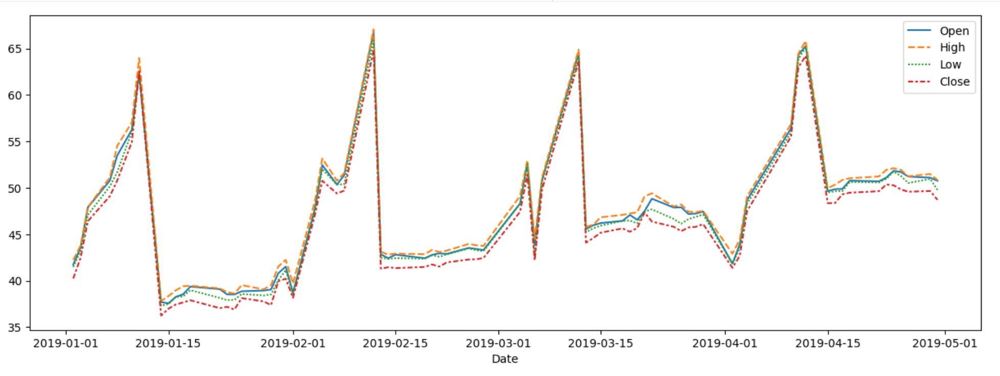
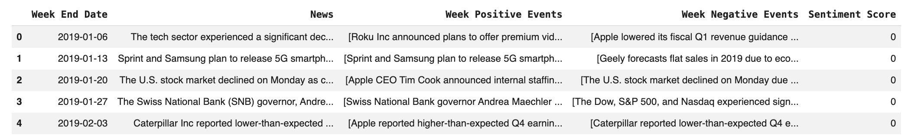

# 🚀 News sentiment analysis and summarisation
An AI-driven system to analyze market sentiment from news articles using SBERT embeddings and a Random Forest classifier to inform stock price predictions.

## 💡 Overview
This project develops an AI-driven sentiment analysis system designed to process and analyze daily news articles related to a specific NASDAQ-listed company. The goal is to gauge market sentiment and integrate this information to enhance the accuracy of stock price predictions and optimize investment strategies. The system leverages advanced natural language processing (NLP) techniques, specifically SBERT (Sentence-BERT) embeddings, combined with machine learning models like Random Forest for multi-class sentiment classification.

## ✨ Features
- **📰 Data Ingestion**: Processes historical daily news, stock prices, and trade volumes.
- **📊 Sentiment Classification**: Utilizes Word2Vec, Glove, SBERT embeddings to convert news text into numerical representations for sentiment analysis.
- **📈 Machine Learning Models**: Implements and evaluates various classification models (Decision Tree, Gradient Boosting, Random Forest) for sentiment prediction.
- **⚡ Hyperparameter Tuning**: Employs `GridSearchCV` to optimize model performance and address overfitting.
- **🤖 Cross-Validation**: Uses `StratifiedKFold` to provide a more robust evaluation of model generalization.
- **✍️ Performance Evaluation**: Measures model effectiveness using `f1_weighted`, accuracy, precision, and recall, with a focus on mitigating overfitting.


## 🧪 Demo / Screenshots
<center> </center>
<center> </center>


## 📌 Architecture
The project follows a typical machine learning pipeline:
1.  **Data Loading and Preprocessing**: Historical stock news and price data are loaded and cleaned. The 'Date' column is converted to datetime objects, and features like news length are engineered.
2.  **Train-Validation-Test Split**: Data is split chronologically to maintain time series integrity.
3.  **Word Embeddings**: Three types of embeddings are explored:
    *   **Word2Vec**: Custom-trained on the news corpus.
    *   **GloVe**: Pre-trained 100d embeddings.
    *   **SBERT (Sentence-BERT)**: Utilizes `all-MiniLM-L6-v2` for sentence-level embeddings, chosen for its contextual understanding.
4.  **Model Training**: Decision Tree, Gradient Boosting, and Random Forest classifiers are trained on the generated embeddings.
5.  **Hyperparameter Tuning**: `GridSearchCV` is used to tune the Random Forest model with SBERT embeddings, specifically addressing overfitting by expanding the search space for parameters like `n_estimators`, `max_depth`, `min_samples_split`, and `max_features`.
6.  **Model Evaluation**: Performance is assessed using F1-weighted score, accuracy, precision, and recall on training, validation, and test sets. Cross-validation is applied for robust evaluation.

## ✍️ Tech Stack
-   **Programming Language**: Python
-   **Libraries**: 
    -   `pandas`, `numpy` (for data manipulation)
    -   `matplotlib`, `seaborn` (for data visualization)
    -   `scikit-learn` (for machine learning models, `GridSearchCV`, `StratifiedKFold`, and metrics)
    -   `gensim` (for Word2Vec and GloVe embeddings)
    -   `sentence-transformers`, `torch`, `transformers` (for SBERT embeddings)
    -   `tqdm` (for progress bars)

## 📊  Dataset / APIs
-   **Dataset**: `stock_news.csv` containing:
    -   `Date`: Date of news release.
    -   `News`: Content of news articles.
    -   `Open`, `High`, `Low`, `Close`: Daily stock prices.
    -   `Volume`: Daily trade volume.
    -   `Label`: Sentiment polarity (1: positive, 0: neutral, -1: negative).
-   **Pre-trained Embeddings**: GloVe (`glove.6B.100d.txt`) and Sentence-BERT (`sentence-transformers/all-MiniLM-L6-v2`).

## 📰 Installation
1.  **Clone the repository**:
    ```bash
    git clone https://github.com/samuelmugisha/news-sentiment-analysis-and-summarisation.git 
    cd news-sentiment-analysis-and-summarisation
    ```
2.  **Install dependencies**:
    ```bash
    pip install -U sentence-transformers==4.1.0 gensim==4.3.3 transformers==4.52.4 tqdm==4.67.1 scikit-learn pandas numpy matplotlib seaborn
    ```
    *Note: If running in Google Colab, ensure you restart the runtime after installing `sentence-transformers` and `gensim`.* Also, download the GloVe embeddings if not already present, the notebook handles this automatically.

## 👨‍💻 Usage
1.  **Load the dataset**: Ensure `stock_news.csv` is accessible (e.g., in Google Drive if using Colab).
2.  **Run the notebook cells sequentially**: The notebook `stock_sentiment_analysis.ipynb` contains all steps from data loading to model evaluation. The notebook `NewsSummarisation.ipynb` contains all steps for News Summarisation. 
3.  **Explore EDA**: Review the univariate and bivariate analysis to understand data distributions and relationships.
4.  **Experiment with models**: Observe the performance of different embedding techniques (Word2Vec, GloVe, SBERT) and classifiers.
5.  **Analyze tuning results**: Focus on the `GridSearchCV` output for the tuned SBERT Random Forest model and the cross-validation results.

## 📌 Results
-   **Initial Overfitting**: All base models (Decision Tree, Gradient Boosting, Random Forest) across all embeddings (Word2Vec, GloVe, SBERT) exhibited severe overfitting, with near-perfect training F1-scores (1.0) but significantly lower validation F1-scores (e.g., Word2Vec DT: 0.248, GloVe RF: 0.427, SBERT RF: 0.505).
-   **SBERT's Promise**: Among the base models, Random Forest with SBERT embeddings showed the best validation performance (F1-score ~0.505), indicating superior contextual understanding.
-   **Tuning Challenges**: The initial hyperparameter tuning of Random Forest with SBERT embeddings did not improve generalization, with the validation F1-score decreasing to ~0.418. This highlighted issues with the initial search space or the small validation set size.
-   **Cross-Validation**: A 5-fold StratifiedKFold cross-validation on the tuned SBERT Random Forest yielded a mean F1-weighted score of **0.4480** (std dev 0.0653), confirming limited generalization.

## 🧪 Challenges & Learnings
-   **Severe Overfitting**: The primary challenge was severe overfitting across all models, likely due to the small dataset size for a complex multi-class sentiment task and the nature of the models.
-   **Small Validation Set**: The very small validation set (21 samples) made performance metrics highly unstable and unreliable for assessing generalization during tuning.
-   **Hyperparameter Search Space**: Initial tuning attempts showed that a restrictive hyperparameter search space could lead to suboptimal results or even worsen performance. Expanding this space is crucial.
-   **Contextual Embeddings**: SBERT embeddings demonstrated better potential than traditional Word2Vec or GloVe, reinforcing the importance of contextual understanding in sentiment analysis.

## 📌 Future Improvements
-   **Larger Dataset**: Acquire and integrate a larger dataset to improve model generalization and stability of evaluation metrics.
-   **Advanced Tuning**: Implement more sophisticated hyperparameter optimization techniques (e.g., RandomizedSearchCV, Bayesian Optimization) with a wider range of parameters, especially for `max_depth` and `min_samples_split`, and potentially different cross-validation strategies.
-   **Other Models**: Experiment with more advanced NLP models (e.g., fine-tuning BERT/RoBERTa directly for classification) or other ensemble methods.
-   **Feature Engineering**: Explore additional features from news articles (e.g., named entity recognition, part-of-speech tagging) or market data.
-   **Time-Series Analysis**: Incorporate the temporal aspect of news and stock prices more deeply, potentially using recurrent neural networks (RNNs) or transformer-based time-series models.
-   **Ensemble Methods**: Develop ensemble models that combine predictions from multiple classifiers to potentially improve robustness and accuracy.


## 📰 Author
[Samuel Mugisha D.C | Data Scientist | A.I Engineer]
```
